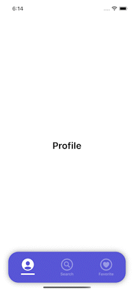

# Custom Tab Bar

The implementation of custom TabBarController. Moving between tabs is fully animated, and items are easy to configure or add a new one.

  

Custom Tab Bar's items changes are handled using RxSwift. For faster implementation purposes SnapKit has been used for the autolayout part, and RxGesture for handling touch gestures on Tab Bar's items.

## Libraries

- RxSwift
- RxGesture
- SnapKit

All libraries are installed using Swift Package Manager.

## License

MIT
